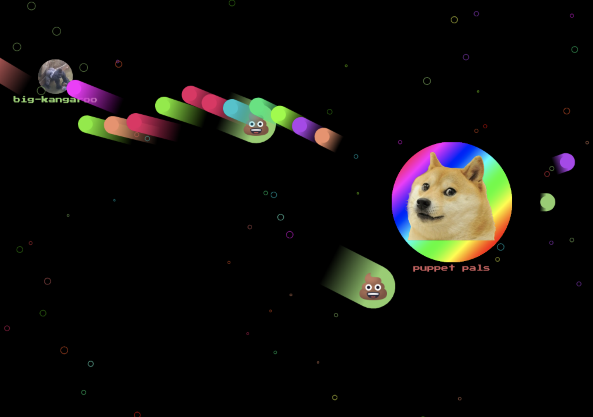
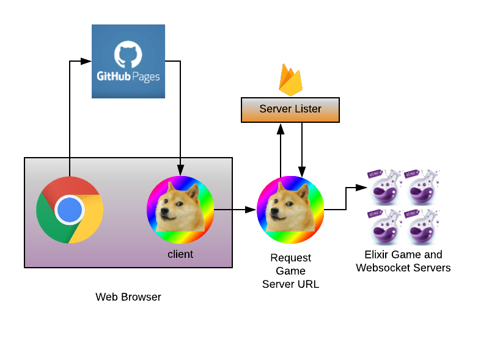

🎉 __Open Source in Celebration of 10k unique players!__ 🎉

[bulletz.io](https://bulletz.io) is an open source real time multiplayer 2D shooter.
The backend is written in the functional programming language Elixir.
The game runs on a custom game engine that was written with fault tolerance in mind.
Fault tolerance is achieved by leveraging erlang's OTP library to create error boundaries around each individual player, bullet, and powerup.
All engine code, logic, networking code, frontend, and backend code are custom written for [bulletz.io](https://bulletz.io).

[Try out the game live!](https://bulletz.io)

# Table of Contents

- [Live Game (bulletz.io)](https://bulletz.io)
- [Development](#Development)
- [Infrastructure](#Infrastructure)
- [Architecture](#Architecture)
- [License](#License)
- [Acknowledgements](#Acknowledgements)

# Infrastructure



The system consists of a few pieces
- [Hugo web client](https://gohugo.io/)
- Elixir Game Servers
- a server lister (currently disabled as I'm only running one server)

Game servers can run anywhere; the current live one runs on a Kubernetes cluster that I run on Google Kubernetes Engine.  

As a cost cutting mechanism Tthe servers are currently pre-emptible, so there is some down time.

# Architecture

The game consists of a Hugo backend under [`client/`](client/) and an
[Elixir](https://elixir-lang.org/) backend hosted under
[`game_server/`](game_server/).

## Frontend Architecture

Hugo is pretty bad in terms of JavaScript and TypeScript interop, so I have a
`client/js_src/` directory containing the TypeScript source, and the Hugo build
relies on the transpiled output which is output to `client/assets/js.app`.

The client is a PWA, written entirely using a custom routing framework.

Quite possibly the _worst_ decision I made in writing `bulletz.io` is to write
the entire frontend based on [RxJS](https://rxjs.dev/).
I did this primarily as a learning exercise because the product I worked on at Google at
the time heavily used [RxJS](https://rxjs.dev/).
Really regret it.

Truth be told, I want to refactor the frontend to be a React/TypeScript/NextJS
app.

## Backend Architecture

The backend server is a stripped down custom [Phoenix server](https://www.phoenixframework.org/).
Each entity has its own OTP entity (excluding food), module, and unique game logic.

All config is held under `game_server/game_config/`.

Every entity exists under `game_server/entities/`.

Services all exist under `game_server/services/`.

Finally, the server itself is under `game_server/socket_server`.

# Development

This section provides an overview of how to setup a local development environment for [bulletz.io](https://bulletz.io).

If you can't get the environment setup, please file an issue at https://github.com/LukeWood/bulletz.io/issues so we can improve the instructions.

## Setup/Installs

First, you'll need to install the following packages:

- NPM & NodeJS

- GNU make
- [hugo](https://gohugo.io)
- Elixir
- tmux

and run the following commands:

- `npm install -g postcss-cli`
- `npm install -g autoprefixer`
- `mix local.rebar`

---

Next, you'll need to get the frontend dependencies:

```
cd client/js_src
yarn
```

---

Next, install backend dependencies:

```
cd game_server/socket_server
mix deps.get
```

## Development Server

Running a dev server should be as easy as:
`make dev-server`

That's all!  Read below the line to see exactly what this command does:

---

`make dev-server` does the following for you:

Create a hugo server instance
`cd client && hugo server -D`

Create a webpack watcher instance
`cd client/js_src && npm run watch`

Run the backend:
`cd game_server/socket_server && MIX_ENV=dev iex -S mix phx.server`

## Getting Up and Running!

Once you have a development server running, try changing a config value!
My recommendation is to go into `game_server/game_config/` and change a few
values.  

See what you can come up with!

# Deployment

Some information about deployments:

## Secrets

To run the highscores,
you'll need to save a firebase admin SDK for the bulletz.io project to:

`game_server/prod/gcp/bulletz-io-firebase-adminsdk.json`

This file is intentionally excluded from the repo for security reasons.  You
probably won't be able to replicate it, but you can ask me to deploy server
updates for you.

Make sure to uncomment:
```
use Mix.Config
config :goth,
  json: "/Users/yeti/workspace/bulletz.io/game_server/prod/gcp/bulletz-io-firebase-adminsdk.json" |> File.read!
```

from `game_server/game_config/config/dev.secret.exs`.

## Makefile

The [Makefile](Makefile) holds all of the deployment tasks.

## Deploying Frontend

The static content can be deployed to any static content server.
Running `hugo` builds the client into the `public` directory.
This should take under a second.
You might need to trigger a new webpack build.
The deploy script is for deploying to github pages which is where bulletz is currently hosted.

`make build-client deploy-client`

## Docker Containers

`make build-dockerized-builder`

There are two docker containers: the builder, which is hosted under
`game_server/docker/builder/` and is responsible for building the server, and
the runtime container, which is hosted at `game_server/docker/runtime/`.

# License

I open source [bulletz.io](https://bulletz.io) so that passionate users can shape the direction of [bulletz.io](https://bulletz.io). Luke Wood is still the sole owner of [bulletz.io](https://bulletz.io).

More formal license:

> You may not use the code for bulletz.io for anything without express written
consent from Luke Wood.
> All code contributed to bulletz.io is sole property of Luke Wood.
By contributing to this repo you acknowledge that the code you contribute is
the sole property of Luke Wood.

# Acknowledgements

By [Luke Wood](https://lukewood.xyz)

Special thanks to [Dave Thomas](https://pragdave.me/) for teaching me Elixir, advising me on OTP structuring, and reviewing the code.

A final thank you to all of the players of [bulletz.io](https://bulletz.io), and to all of my wonderful friends who have playtested [bulletz.io](bulletz.io) along the way.
